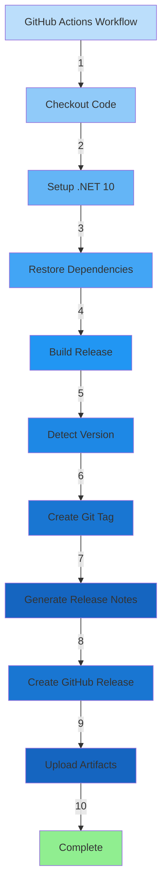
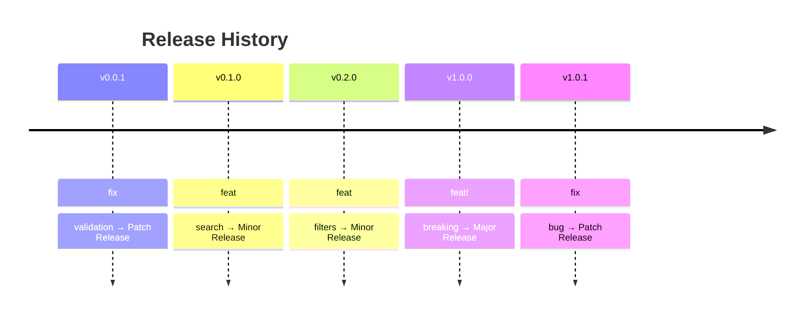
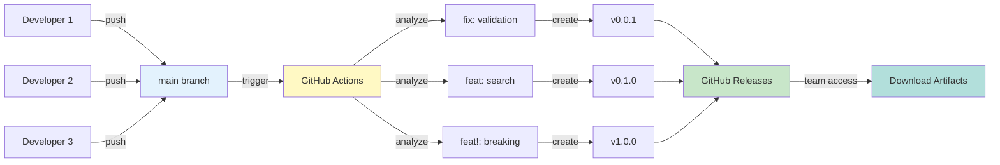
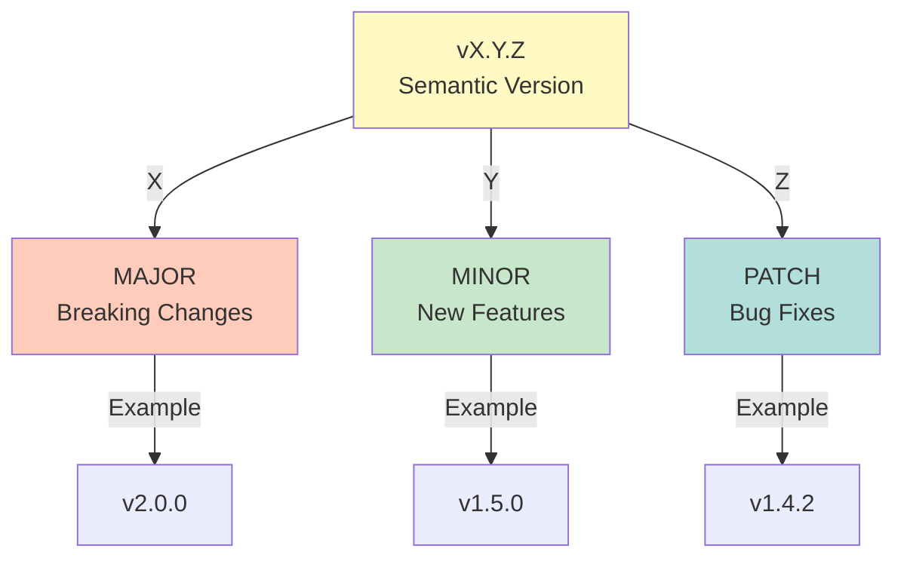

# GitHub Actions - Semantic Release & CI/CD Pipeline

## Quick Start (5 minutes)

### How It Works

Every time you push code to the `main` branch with a conventional commit message, GitHub Actions automatically:
1. Builds your ASP.NET Core application
2. Detects semantic version based on commit type
3. Creates a GitHub Release with version tag
4. Publishes compiled artifacts (ZIP file)

### Commit Message Format

```bash
fix: correct bug              # Creates v0.0.X (Patch)
feat: add feature             # Creates v0.X.0 (Minor)
feat!: breaking change        # Creates vX.0.0 (Major)
```

### Example Usage

```bash
git add .
git commit -m "feat: add student search endpoint"
git push origin main
# GitHub Actions automatically creates release v0.1.0 ✅
```

---

## Version Bumping Rules

### PATCH Release (Bug Fixes)
```bash
git commit -m "fix: correct email validation"
# Previous: v0.5.2 → New: v0.5.3
```
- Bug fixes
- No new features
- Backward compatible

### MINOR Release (New Features)
```bash
git commit -m "feat: add search functionality"
# Previous: v0.5.2 → New: v0.6.0
```
- New features
- Backward compatible
- Enhancement

### MAJOR Release (Breaking Changes)
```bash
git commit -m "feat!: redesign API response format"
# Previous: v0.5.2 → New: v1.0.0
```
Or with detailed message:
```bash
git commit -m "refactor: change database schema

BREAKING CHANGE: Students table restructured"
```
- Breaking changes
- Incompatible API changes
- Major architectural changes

---

## Workflow Pipeline

```mermaid
graph LR
    A["📝 Push to main<br/>Conventional Commit"] -->|Trigger| B["🔨 Build<br/>ASP.NET Core 10"]
    B -->|Success| C["📊 Analyze<br/>Commit Message"]
    C -->|Parse| D["🔢 Calculate<br/>Semantic Version"]
    D -->|Determine| E["🏷️ Create<br/>Git Tag"]
    E -->|Push| F["📦 Create<br/>GitHub Release"]
    F -->|Publish| G["📥 Upload<br/>Artifacts ZIP"]
    G -->|Complete| H["✅ Release<br/>Published"]
    
    style A fill:#e3f2fd
    style B fill:#f3e5f5
    style C fill:#f3e5f5
    style D fill:#fff9c4
    style E fill:#e8f5e9
    style F fill:#c8e6c9
    style G fill:#b2dfdb
    style H fill:#90ee90
```



---

## Workflow File Structure

**Location:** `.github/workflows/release.yml`



---

## Release Notes Generation

Each automatic release includes:
- **Version tag** (v0.1.0)
- **Commit message** (changelog)
- **Author information** (name, email)
- **Commit SHA** (7-character hash)
- **Release date** (ISO format)
- **Technology stack** info
- **Downloadable artifacts** (ZIP file)

Example release:
```
## Release v0.1.0

Version: 0.1.0

Changes:
- feat: add student search functionality

Commit Info:
- Author: John Doe (john@example.com)
- Commit: abc1234d

Technology Stack:
- ASP.NET Core 10
- Entity Framework Core 10
- SQLite
- CQRS Pattern

Release Date: 2026-04-16T10:30:00Z
```

---

## Version History Example



---

## Configuration

### Workflow Triggers
- ✅ Triggers on push to `main` branch
- ❌ Does NOT run on other branches
- ❌ Does NOT run on pull requests

### Permissions
```yaml
permissions:
  contents: write    # Create tags and releases
  packages: write    # Future package publishing
```

### Environment
- **Framework**: ASP.NET Core 10
- **Database**: SQLite
- **ORM**: Entity Framework Core 10
- **Build Mode**: Release

---

## Troubleshooting

### Workflow not triggering?
```
Check:
1. Push is to 'main' branch (not 'master' or other)
2. Commit message uses conventional format (fix:, feat:, feat!:)
3. GitHub Actions enabled in repository settings
```

### Release not created?
```
Check:
1. Workflow logs in GitHub Actions tab
2. Commit message follows convention
3. Build completed successfully
```

### Wrong version bump?
```
Check commit message format:
- "fix:" → PATCH (v0.0.X)
- "feat:" → MINOR (v0.X.0)
- "feat!:" → MAJOR (vX.0.0)
```

### Can't download artifacts?
```
1. Go to repository Releases tab
2. Find release version
3. Download ZIP file from Assets section
4. Artifacts stored for 90 days (GitHub default)
```

---

## Commit Message Examples

### Good Examples
```bash
✅ fix: correct student email validation
✅ feat: add student search by name
✅ feat: implement pagination for endpoints
✅ feat!: redesign student response format
✅ fix: resolve database connection timeout
```

### Bad Examples
```bash
❌ updated code
❌ fix stuff
❌ added feature
❌ changes to model
❌ final version
```

---

## GitHub Repository Integration

### Viewing Releases
```
1. Go to your GitHub repository
2. Click "Releases" tab
3. See version history with download links
```

### Viewing Workflow Status
```
1. Go to your GitHub repository
2. Click "Actions" tab
3. Watch "Release with Semantic Versioning" workflow
4. Click on run to see detailed logs
```

### Git Tags
```bash
# List all tags locally
git tag -l

# Show latest tag
git tag -l --sort=-version:refname | head -n 1

# List tags remotely
git ls-remote --tags origin
```

---

## Team Workflow



---

## Best Practices

✅ **Use meaningful commit messages** - Helps generate better release notes  
✅ **Keep commits atomic** - One logical change per commit  
✅ **Follow conventions strictly** - Ensures correct version bumping  
✅ **Keep main branch stable** - Only merge tested code  
✅ **Review before push** - Prevents accidental releases  
✅ **Document breaking changes** - Use BREAKING CHANGE: in message body  

---

## Release Artifacts

Each release includes:
- **MyDemoApp-vX.Y.Z.zip** - Compiled application ready for deployment
- **GitHub Release page** - With release notes and commit info
- **Git tag** - Version tag in repository history

### File Retention
- Artifacts stored for 90 days (GitHub default policy)
- Tags stored permanently in git history
- Releases accessible indefinitely

---

## Supported Commit Types

### Type: `fix`
- **Description**: Bug fixes and patches
- **Version Bump**: PATCH
- **Example**: `fix: resolve student age validation`

### Type: `feat`
- **Description**: New features
- **Version Bump**: MINOR
- **Example**: `feat: add student filtering endpoint`

### Type: `feat!` or `BREAKING CHANGE`
- **Description**: Breaking changes
- **Version Bump**: MAJOR
- **Example**: `feat!: redesign response format`

### Type: `docs` (no release)
- Documentation updates don't trigger releases

### Type: `chore` (no release)
- Maintenance tasks don't trigger releases

---

## Workflow Performance

| Task | Duration |
|------|----------|
| Checkout code | < 5 seconds |
| Setup .NET | 10-15 seconds |
| Restore packages | 5-10 seconds |
| Build application | 10-20 seconds |
| Detect version | < 5 seconds |
| Create release | 10-15 seconds |
| Upload artifacts | 5-10 seconds |
| **Total** | **45-90 seconds** |

---

## Common Scenarios

### Scenario 1: Bug Fix Release
```bash
# Fix a bug in validation
git commit -m "fix: correct email format validation"
git push origin main

# Result: v0.0.1 release created automatically
```

### Scenario 2: Feature Release
```bash
# Add new search functionality
git commit -m "feat: implement student search by name"
git push origin main

# Result: v0.1.0 release created automatically
```

### Scenario 3: Major Version Release
```bash
# Breaking API change
git commit -m "feat!: change response structure

BREAKING CHANGE: API response format updated"
git push origin main

# Result: v1.0.0 release created automatically
```

---

## Semantic Versioning Reference



---

## FAQ

**Q: How often should I release?**  
A: Every push to main with a conventional commit creates a release. Batch commits as needed.

**Q: Can I skip creating a release?**  
A: Yes, by not using conventional commit format, but it's not recommended.

**Q: What if I make multiple commits?**  
A: Each commit creates one release. Consider batching before push for batch releases.

**Q: Can I manually create releases?**  
A: Yes, but the workflow won't automatically manage versioning for manual releases.

**Q: Where are my artifacts?**  
A: Download ZIP files from the GitHub Releases page (90-day retention).

**Q: Can I customize the workflow?**  
A: Yes! Edit `.github/workflows/release.yml` to add additional steps (tests, deployment, notifications).

---

## Semantic Versioning Standard

This project follows **Semantic Versioning 2.0.0**

- **MAJOR** (v1.0.0): Incompatible API changes
- **MINOR** (v0.1.0): Backward-compatible features
- **PATCH** (v0.0.1): Backward-compatible bug fixes

Reference: https://semver.org/

---

## Resources

- **Semantic Versioning**: https://semver.org/
- **Conventional Commits**: https://www.conventionalcommits.org/
- **GitHub Actions**: https://docs.github.com/en/actions
- **GitHub Releases**: https://docs.github.com/en/repositories/releasing-projects-on-github

---

## Technology Stack

- **Framework**: ASP.NET Core 10
- **Database**: SQLite with EF Core
- **Architecture**: CQRS Pattern
- **CI/CD**: GitHub Actions
- **Versioning**: Semantic with Conventional Commits

---

**Last Updated**: April 16, 2026  
**Status**: ✅ Ready for Production

