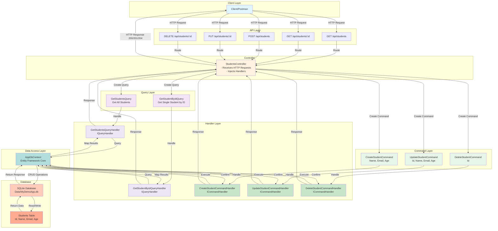
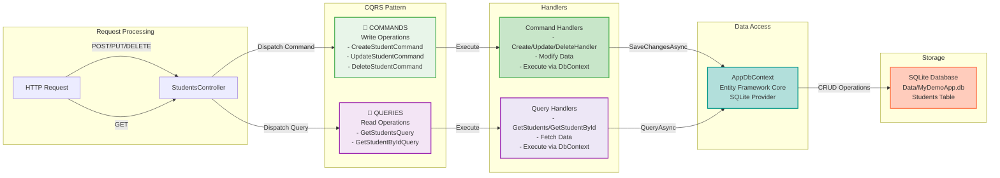
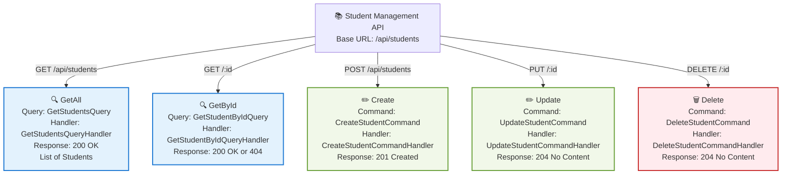
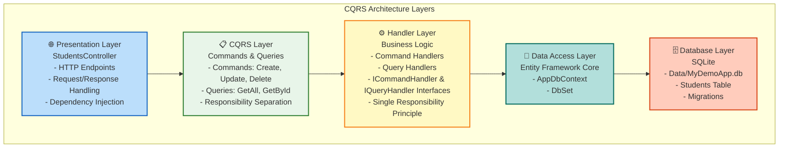

# MyDemoApp - CQRS Pattern Implementation

[](https://github.com/UmmeAyeshaKazi/Simple_CQRS_Pattern/actions/workflows/release.yml)
[](https://github.com/UmmeAyeshaKazi/Simple_CQRS_Pattern/releases)
[](https://opensource.org/licenses/MIT)

A simple CQRS (Command Query Responsibility Segregation) application built with ASP.NET Core 10, Entity Framework Core, and SQLite without using MediatR library.

## Table of Contents
- [Architecture Overview](#architecture-overview)
- [Project Structure](#project-structure)
- [API Endpoints](#api-endpoints)
- [CQRS Flow](#cqrs-flow)
- [Getting Started](#getting-started)
- [Technology Stack](#technology-stack)
- [Releases](#releases)
- [Documentation](#documentation)

## Architecture Overview

This application demonstrates a clean CQRS pattern implementation organized in a single-layer project with separate folders for each logic component. The architecture follows SOLID principles and separates read operations (Queries) from write operations (Commands).

### Complete Request-Response Flow with CQRS & Handlers



### CQRS Pattern Flow Diagram



### API Endpoints & CRUD Operations



### Architecture Layers



## Project Structure

```
MyDemoApp.WebAPI/
├── Data/                          # Database context & configuration
│   ├── AppDbContext.cs           # Entity Framework DbContext
│   └── MyDemoApp.db              # SQLite database file
├── Models/                        # Domain models
│   └── Student.cs                # Student entity (Id, Name, Email, Age)
├── Commands/                      # Write operations (CQRS)
│   ├── CreateStudentCommand.cs   # Create new student
│   ├── UpdateStudentCommand.cs   # Update existing student
│   └── DeleteStudentCommand.cs   # Delete student
├── Queries/                       # Read operations (CQRS)
│   ├── GetStudentsQuery.cs       # Get all students
│   └── GetStudentByIdQuery.cs    # Get single student
├── Handlers/                      # Command & Query handlers
│   ├── IHandlers.cs              # Handler interfaces
│   ├── CreateStudentCommandHandler.cs
│   ├── UpdateStudentCommandHandler.cs
│   ├── DeleteStudentCommandHandler.cs
│   ├── GetStudentsQueryHandler.cs
│   └── GetStudentByIdQueryHandler.cs
├── Controllers/                   # API endpoints
│   └── StudentsController.cs     # CRUD operations
├── Migrations/                    # EF Core migrations
│   ├── 20260416104308_InitialCreate.cs
│   └── AppDbContextModelSnapshot.cs
├── Program.cs                     # DI configuration
├── appsettings.json              # Configuration
└── MyDemoApp.WebAPI.csproj       # Project file
```

## API Endpoints

### Get All Students
```http
GET /api/students
```
**Response:** 200 OK
```json
[
  {
    "id": 1,
    "name": "John Doe",
    "email": "john@example.com",
    "age": 20
  }
]
```

### Get Student by ID
```http
GET /api/students/{id}
```
**Response:** 200 OK or 404 Not Found

### Create Student
```http
POST /api/students
Content-Type: application/json

{
  "name": "Jane Smith",
  "email": "jane@example.com",
  "age": 21
}
```
**Response:** 201 Created

### Update Student
```http
PUT /api/students/{id}
Content-Type: application/json

{
  "name": "Jane Smith Updated",
  "email": "jane.updated@example.com",
  "age": 22
}
```
**Response:** 204 No Content

### Delete Student
```http
DELETE /api/students/{id}
```
**Response:** 204 No Content

## Getting Started

### Prerequisites
- .NET 10 SDK
- SQLite (included with EF Core)

### Installation

1. **Clone the repository**
```bash
git clone <repository-url>
cd MyDemoApp.WebAPI
```

2. **Restore NuGet packages**
```bash
dotnet restore
```

3. **Create the database**
```bash
dotnet ef database update
```

4. **Run the application**
```bash
dotnet run
```

The API will be available at `https://localhost:5001` or `http://localhost:5000`

### API Documentation
Visit the Swagger UI: `https://localhost:5001/openapi`
Or visit the Scalar API reference: `https://localhost:5001/scalar`

## Technology Stack

- **Framework**: ASP.NET Core 10
- **Database**: SQLite
- **ORM**: Entity Framework Core 10
- **Pattern**: CQRS (Command Query Responsibility Segregation)
- **Architecture**: Single-layer with organized folders
- **Principles**: SOLID

## CQRS Pattern Explanation

### Commands (Write Operations)
Commands are objects that represent requests to perform actions that modify state. They are dispatched to command handlers that execute the business logic and persist changes to the database.

**Examples:**
- `CreateStudentCommand` → Creates a new student
- `UpdateStudentCommand` → Modifies existing student
- `DeleteStudentCommand` → Removes a student

### Queries (Read Operations)
Queries are objects that represent requests to fetch data. They are dispatched to query handlers that retrieve information from the database without modifying state.

**Examples:**
- `GetStudentsQuery` → Retrieves all students
- `GetStudentByIdQuery` → Retrieves a specific student

### Handlers
Handlers contain the business logic for processing commands and queries. They implement `ICommandHandler<T>` or `IQueryHandler<TQuery, TResult>` interfaces.

## Benefits of This Approach

✅ **Separation of Concerns**: Commands and Queries are clearly separated  
✅ **SOLID Principles**: Each handler has a single responsibility  
✅ **Scalability**: Easy to extend with new commands/queries  
✅ **Testability**: Handlers can be unit tested independently  
✅ **Maintainability**: Clear structure makes code easier to understand  
✅ **No External Dependencies**: Custom implementation without MediatR  

## Database Migrations

### Create a new migration
```bash
dotnet ef migrations add MigrationName
```

### Apply migrations
```bash
dotnet ef database update
```

### Remove last migration
```bash
dotnet ef migrations remove
```

## Releases & Versioning

This project uses **Semantic Versioning** with **Conventional Commits** and GitHub Actions for automated releases.

### How Releases Work

Releases are automatically created when code is pushed to the `main` branch using the following commit message format:

#### Commit Message Format (Conventional Commits)

**Patch Release** (v0.0.X → v0.0.X+1):
```bash
git commit -m "fix: correct validation logic"
```

**Minor Release** (v0.X.0 → v0.X+1.0):
```bash
git commit -m "feat: add search functionality"
```

**Major Release** (vX.0.0 → vX+1.0.0):
```bash
git commit -m "feat!: redesign API response format"
# or
git commit -m "refactor: restructure models

BREAKING CHANGE: API response structure changed"
```

### Workflow

1. Push code to `main` branch with conventional commit message
2. GitHub Actions automatically runs
3. Determines next semantic version
4. Creates Git tag and GitHub Release
5. Publishes application artifacts

### View Releases

- **GitHub Releases**: https://github.com/YOUR_USERNAME/MyDemoApp/releases
- **GitHub Actions**: https://github.com/YOUR_USERNAME/MyDemoApp/actions
- **Release Details**: Each release includes changelog, artifacts, and version info

### For More Information

See [Documentation/CICD_GITHUB_ACTIONS.md](./Documentation/CICD_GITHUB_ACTIONS.md) for detailed documentation on:
- Version bumping rules
- Commit message conventions
- How to trigger different release types
- Troubleshooting release workflows

## Documentation

All detailed documentation is located in the [Documentation/](./Documentation/) folder:

- **[CICD_GITHUB_ACTIONS.md](./Documentation/CICD_GITHUB_ACTIONS.md)** - Complete guide for GitHub Actions, semantic versioning, and release workflow

## License

This project is open source and available under the MIT License.

## Contributing

Contributions are welcome! Please feel free to submit a Pull Request.

When contributing, please follow the [Conventional Commits](https://www.conventionalcommits.org/) specification for commit messages to ensure proper semantic versioning.

---

**Created**: April 16, 2026  
**Framework**: ASP.NET Core 10  
**Pattern**: CQRS without MediatR  
**CI/CD**: GitHub Actions with Semantic Versioning
